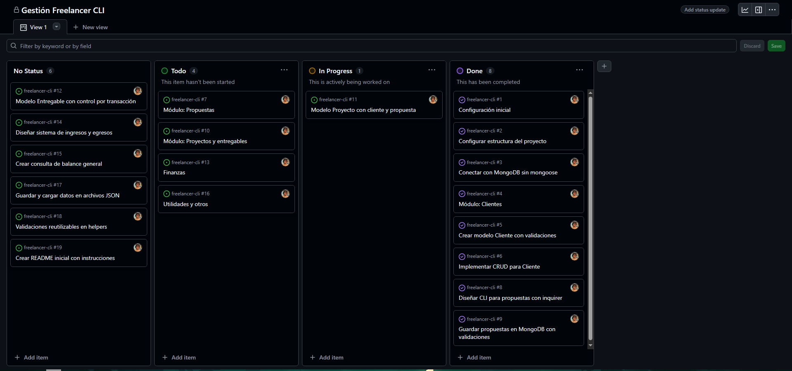
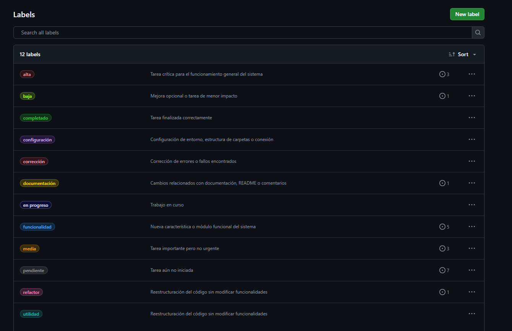
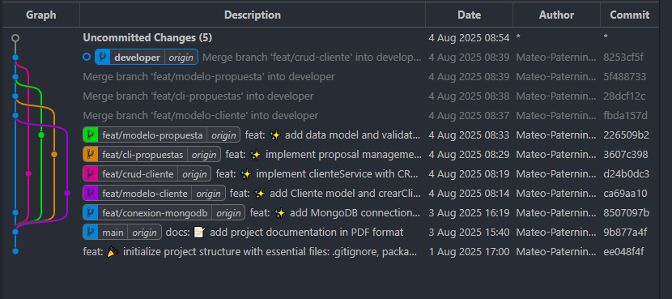
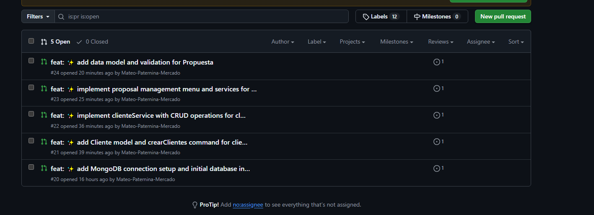

# 💼 Freelancer CLI

Una aplicación de consola (CLI) construida con Node.js para la gestión de freelancers, incluyendo clientes y propuestas, con conexión a MongoDB local. Desarrollado como parte de un proyecto educativo en Campuslands.

---

## 📌 Características implementadas

- 📁 Conexión a MongoDB local usando variables de entorno.
- 👤 Modelo `Cliente` con validaciones.
- 📝 CLI para **crear**, **listar** y **eliminar** propuestas.
- 🔗 Vinculación de propuestas con clientes existentes.
- ✅ Validación de título, descripción, fecha y cliente relacionado.

---

## 📂 Estructura del proyecto

```
freelancer-cli/
│
├── src/
│   ├── config/          # Conexión MongoDB
│   │   └── db.js
│   ├── models/          # Modelos: Cliente, Propuesta
│   ├── services/        # Lógica de negocio
│   ├── commands/        # Comandos del CLI (crear, listar, eliminar)
│   ├── utils/           # Validaciones, helpers
│   └── index.js         # CLI principal
│
├── .env                 # URI de conexión local
├── .gitignore           # Ignora node_modules, .env
├── package.json
├── README.md            # Este archivo
└── scrum-plan.pdf       # Planeación SCRUM
```

---

## ⚙️ Instalación y ejecución

### 1. Clonar el repositorio
```bash
git clone https://github.com/<tu-usuario>/freelancer-cli.git
cd freelancer-cli
```

### 2. Instalar dependencias
```bash
npm install
```

### 3. Configurar variables de entorno

En el archivo `.env`, deja tu URI local:
```
MONGODB_URI=mongodb://localhost:27017/freelancer_cli
```

### 4. Ejecutar el CLI
```bash
node src/index.js
```

---

## 🧪 Comandos disponibles

Desde el CLI puedes:

- Crear propuesta
- Listar propuestas existentes
- Eliminar propuestas
- (Próximamente) Crear proyectos, contratos, entregables, etc.

---

## 🛠 Tecnologías utilizadas

- Node.js
- MongoDB local
- `dotenv` para variables de entorno
- `inquirer` para interacción CLI
- Estructura modular con principios SOLID

---

## 👨‍💻 Equipo de trabajo

| Rol              | Nombre                         |
|------------------|--------------------------------|
| Scrum Master     | Mateo Paternina Mercado        |
| Product Owner    | Daniel Felipe Florez Cubides   |
| Desarrolladores  | Mateo y Daniel                 |

---

## 🔗 SCRUM y GitHub Projects

- Tablero organizado en `GitHub Projects`.

- Issues con labels (`tipo`, `prioridad`, `estado`).

- Ramas: `feat/conexion-mongodb`, `feat/modelo-cliente`, `feat/cli-propuestas`.

- Cada rama con su PR y vinculación a issues (`Closes #`).


---

## 📌 Estado actual

✅ Fase de cliente y propuestas terminada.  
🚧 Pendiente: proyectos, contratos, entregables, finanzas.

---

## 📝 Licencia

Proyecto académico para Campuslands. Uso educativo.
